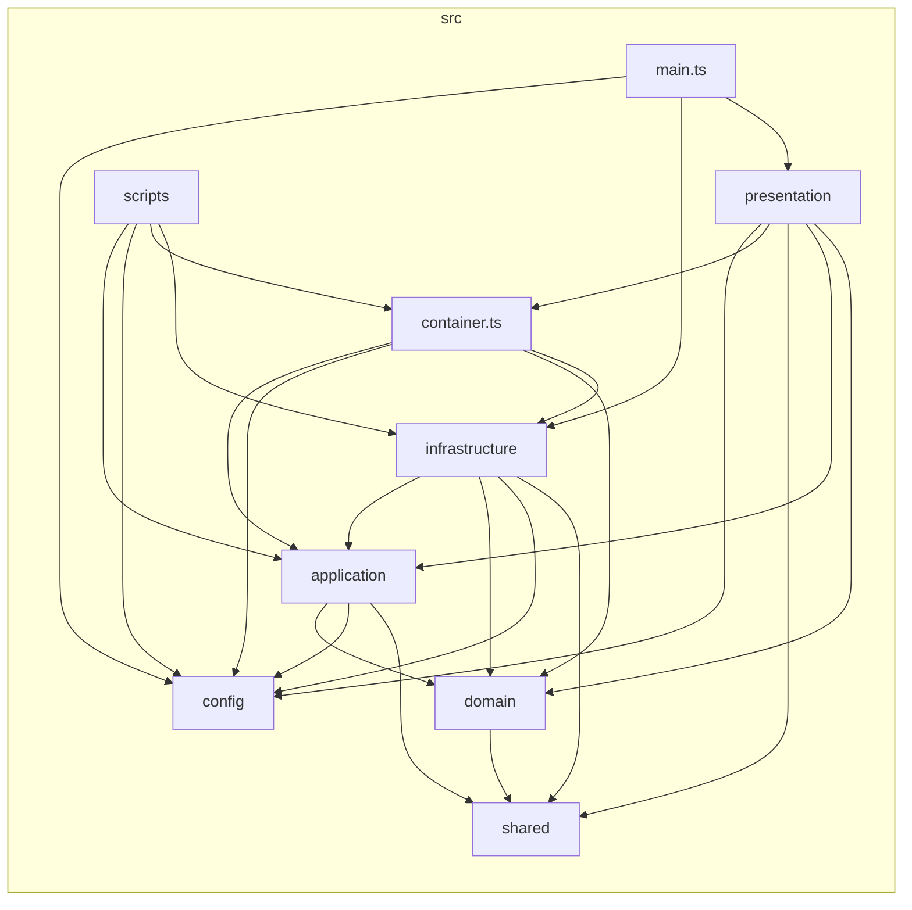

```mermaid
flowchart LR

subgraph src["src"]
  src_application["application"]
  src_config["config"]
  src_container_ts["container.ts"]
  src_domain["domain"]
  src_infrastructure["infrastructure"]
  src_main_ts["main.ts"]
  src_presentation["presentation"]
  src_scripts["scripts"]
  src_shared["shared"]
end
src_application-->src_domain
src_application-->src_config
src_application-->src_shared
src_container_ts-->src_application
src_container_ts-->src_config
src_container_ts-->src_domain
src_container_ts-->src_infrastructure
src_domain-->src_shared
src_infrastructure-->src_application
src_infrastructure-->src_domain
src_infrastructure-->src_config
src_infrastructure-->src_shared
src_main_ts-->src_config
src_main_ts-->src_infrastructure
src_main_ts-->src_presentation
src_presentation-->src_config
src_presentation-->src_container_ts
src_presentation-->src_shared
src_presentation-->src_application
src_presentation-->src_domain
src_scripts-->src_application
src_scripts-->src_config
src_scripts-->src_container_ts
src_scripts-->src_infrastructure
```
